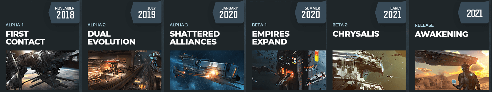

# Awesome-DualUniverse

A curated list of awesome Lua scripts, tutorials, resources and third party tools about Dual Universe.

Note that as Pre-Alpha/Alpha stages are under [NDA](https://board.dualthegame.com/index.php?/topic/11688-pre-alpha-faq-and-rules/), this list may be quickly outdated with current development version. 

All kind of contributions are welcome ! Process to be listed:

* Create a Pull Request with the name of a resource, an URL and a very brief description of the content.
* If approved, it will be added! ;)

## :stars: Dual Universe Roadmap

Dual universe is still under active development. This temporary section displays major milestones before official release.



* [DevDiary Playlist](https://www.youtube.com/playlist?list=PLA_lhIAGheMGtAygniJs25JDsWgxbfk6V) - Monthly videos about game development progress.
* [Community Suggestions Trello](https://trello.com/b/Y6WNMd2S/dual-universe-community-suggestions) - A trello board tracking various concepts and suggestions made by the community.


## :page_with_curl: Lua Scripting

This section is about Lua scripting in Dual Universe and not related to Lua general use cases. For lua specific resources, you should check [awesome-lua](https://github.com/LewisJEllis/awesome-lua#readme).

### Tutorials

Online tutorials about Lua scripting in Dual Universe. 

* [Dual Universe Pre-Alpha Tutorial: Lua Scripting](https://www.youtube.com/watch?v=sbvJPuo9npE) - Youtube tutorial by Dual Universe developers which explains in-game scripting features. (2017)


### Community Scripts

Lua scripts maintained by the community.

```
Empty section
```

### Scripting Tools and Resources

Various tools and resources for in-game Lua scripting.

* [VSCode plugin](https://marketplace.visualstudio.com/items?itemName=ciaanh.du-project) - Visual Studio Code extension to manage Lua projects for Dual Universe outside of the game.
* [GamePedia Wiki](https://dualuniverse.gamepedia.com/Lua_Scripting) - Gamepedia wiki centralizing available informations about Dual Universe.
* [DU DevDiary Scripting Showcase](https://www.youtube.com/watch?v=4Vrf50dZrv4) - A showcase of the scripting feature from the DU Youtube channel (2017)


## :hammer: Third party tools

Third party applications and tools about Dual Universe.

```
Empty section
```

## :beer: Developer resources

Resources for third party development. (APIs, Docs, Tutorials, ...)

```
Empty section
```

## :heart: Community

* [Official Forums](https://board.dualthegame.com/) - Official Dual Universe community forums
* [Official Discord](https://www.dualthegame.com/en/news/2018/09/10/dual-universe-official-discord-server/) - Official Discord server about Dual Universe managed by Novaquark developers. It's a really active and friendly community.
* [FR Community - DualFR](https://dualfr.org/) - News, Articles, Tutorials, Discord Server.

